demographics-and-employment-united-states-analysis
================
Vasundhara Sharma
2/16/2022

``` r
library(tidyverse)
```

    ## -- Attaching packages --------------------------------------- tidyverse 1.3.1 --

    ## v ggplot2 3.3.5     v purrr   0.3.4
    ## v tibble  3.1.4     v dplyr   1.0.7
    ## v tidyr   1.1.4     v stringr 1.4.0
    ## v readr   2.0.2     v forcats 0.5.1

    ## -- Conflicts ------------------------------------------ tidyverse_conflicts() --
    ## x dplyr::filter() masks stats::filter()
    ## x dplyr::lag()    masks stats::lag()

``` r
library(ggrepel)
library(hrbrthemes)
```

    ## NOTE: Either Arial Narrow or Roboto Condensed fonts are required to use these themes.

    ##       Please use hrbrthemes::import_roboto_condensed() to install Roboto Condensed and

    ##       if Arial Narrow is not on your system, please see https://bit.ly/arialnarrow

``` r
library(viridis)
```

    ## Loading required package: viridisLite

``` r
library(RColorBrewer)
library(gridExtra)
```

    ## 
    ## Attaching package: 'gridExtra'

    ## The following object is masked from 'package:dplyr':
    ## 
    ##     combine

``` r
library(ggalluvial)
```

``` r
# reading the data file
df_cps <- read.csv('CPSData.csv', na.string = '')
```

``` r
# checking column types and dimensions of data frame
str(df_cps)
```

    ## 'data.frame':    131302 obs. of  14 variables:
    ##  $ PeopleInHousehold : int  1 3 3 3 3 3 3 2 2 2 ...
    ##  $ Region            : chr  "South" "South" "South" "South" ...
    ##  $ State             : chr  "Alabama" "Alabama" "Alabama" "Alabama" ...
    ##  $ MetroAreaCode     : chr  "26620" "13820" "13820" "13820" ...
    ##  $ Age               : int  85 21 37 18 52 24 26 71 43 52 ...
    ##  $ Married           : chr  "Widowed" "Never Married" "Never Married" "Never Married" ...
    ##  $ Sex               : chr  "Female" "Male" "Female" "Male" ...
    ##  $ Education         : chr  "Associate degree" "High school" "High school" "No high school diploma" ...
    ##  $ Race              : chr  "White" "Black" "Black" "Black" ...
    ##  $ Hispanic          : int  0 0 0 0 0 0 0 0 0 0 ...
    ##  $ CountryOfBirthCode: int  57 57 57 57 57 57 57 57 57 57 ...
    ##  $ Citizenship       : chr  "Citizen, Native" "Citizen, Native" "Citizen, Native" "Citizen, Native" ...
    ##  $ EmploymentStatus  : chr  "Retired" "Unemployed" "Disabled" "Not in Labor Force" ...
    ##  $ Industry          : chr  "NA" "Professional and business services" "NA" "NA" ...

``` r
# checking for NA values in each column 
df_cps %>% select(everything()) %>% summarise_all(list(~sum(is.na(.))))
```

    ##   PeopleInHousehold Region State MetroAreaCode Age Married Sex Education Race
    ## 1                 0      0     0             0   0       0   0         0    0
    ##   Hispanic CountryOfBirthCode Citizenship EmploymentStatus Industry
    ## 1        0                  0           0                0        0

``` r
# checking summary for Age column 
summary(df_cps$Age)
```

    ##    Min. 1st Qu.  Median    Mean 3rd Qu.    Max. 
    ##    0.00   19.00   39.00   38.83   57.00   85.00

``` r
# checking summary for People In Household column
summary(df_cps$PeopleInHousehold)
```

    ##    Min. 1st Qu.  Median    Mean 3rd Qu.    Max. 
    ##   1.000   2.000   3.000   3.284   4.000  15.000

# Gender Analysis

``` rwarning
# checking the gender percentage in the dataset
df_cps %>% group_by(Sex) %>% summarise(Total.Count = n())
```

## Age Groups

``` r
# creating age groups and categorizing data
df_cps_age_group <- df_cps %>% 
  select(Sex, Age) %>% 
  mutate(Age.Group = case_when(Age >= 0  & Age <= 10 ~ '0-10',
                                        Age >= 11  & Age <= 20 ~ '11-20',
                                        Age >= 21  & Age <= 30 ~ '21-30',
                                        Age >= 31  & Age <= 40 ~ '31-40',
                                        Age >= 41  & Age <= 50 ~ '41-50',
                                        Age >= 51  & Age <= 60 ~ '51-60',
                                        Age >= 61  & Age <= 70 ~ '61-70',
                                        Age >= 71  & Age <= 80 ~ '71-80',
                                        Age >= 81  & Age <= 90 ~ '81-90',
                                        Age >= 91  & Age <= 100 ~ '91-100')) %>%
  group_by(Sex, Age.Group) %>%
  summarise(Total.Count = n())
```

    ## `summarise()` has grouped output by 'Sex'. You can override using the `.groups` argument.

``` r
df_cps_age_group
```

    ## # A tibble: 18 x 3
    ## # Groups:   Sex [2]
    ##    Sex    Age.Group Total.Count
    ##    <chr>  <chr>           <int>
    ##  1 Female 0-10             8775
    ##  2 Female 11-20            8278
    ##  3 Female 21-30            8443
    ##  4 Female 31-40            8633
    ##  5 Female 41-50            9131
    ##  6 Female 51-60            9749
    ##  7 Female 61-70            7478
    ##  8 Female 71-80            5431
    ##  9 Female 81-90            1563
    ## 10 Male   0-10             9453
    ## 11 Male   11-20            8653
    ## 12 Male   21-30            8022
    ## 13 Male   31-40            7929
    ## 14 Male   41-50            8643
    ## 15 Male   51-60            9058
    ## 16 Male   61-70            6727
    ## 17 Male   71-80            4453
    ## 18 Male   81-90             883

``` r
# plotting female and male population with their age category
df_cps %>% 
  ggplot(aes(x = Age, fill = Sex)) +
  geom_histogram(color = "#e9ecef", alpha = 0.8, position = 'identity', 
                binwidth = 10, mapping = aes(x = Age), boundary = 0) +
  scale_fill_manual(values = c('#450d54', '#21918c')) +
  theme_ipsum() + 
  xlab('Age') + xlim(0, 100) + 
  ylab('Number of People') + ylim(0, 10000) +
  scale_x_continuous(breaks=seq(0, 100, 10))
```

    ## Scale for 'x' is already present. Adding another scale for 'x', which will
    ## replace the existing scale.

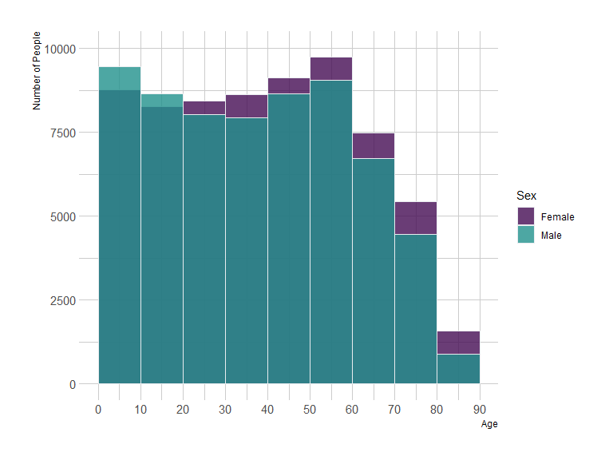<!-- -->

## Education Status

``` r
# calculating number of females and males and their education levels
df_cps_education <- df_cps %>% 
  group_by(Sex, Education) %>%
  summarise(Total.Count = n()) 
```

    ## `summarise()` has grouped output by 'Sex'. You can override using the `.groups` argument.

``` r
df_cps_education
```

    ## # A tibble: 18 x 3
    ## # Groups:   Sex [2]
    ##    Sex    Education               Total.Count
    ##    <chr>  <chr>                         <int>
    ##  1 Female Associate degree               5615
    ##  2 Female Bachelor's degree             10333
    ##  3 Female Doctorate degree                613
    ##  4 Female High school                   15577
    ##  5 Female Master's degree                4400
    ##  6 Female NA                            12217
    ##  7 Female No high school diploma         8049
    ##  8 Female Professional degree             565
    ##  9 Female Some college, no degree       10112
    ## 10 Male   Associate degree               4298
    ## 11 Male   Bachelor's degree              9110
    ## 12 Male   Doctorate degree                903
    ## 13 Male   High school                   15329
    ## 14 Male   Master's degree                3416
    ## 15 Male   NA                            13121
    ## 16 Male   No high school diploma         8046
    ## 17 Male   Professional degree             847
    ## 18 Male   Some college, no degree        8751

``` r
# plotting gender and their education level
ggplot(df_cps_education, 
       aes(fill = Sex, 
           y = factor(Education, 
                      levels = rev(c('NA', 'No high school diploma',
                                     'High school', 'Associate degree',
                                     'Some college, no degree', 
                                     'Bachelor\'s degree', 'Master\'s degree',
                                     'Professional degree', 'Doctorate degree'))), 
           x = Total.Count)) +
  geom_bar(width = 0.8, 
           position = position_dodge(0.8), 
           stat = "identity") +
  scale_fill_manual(values = c('#450d54', '#21918c')) + 
  theme_ipsum() +
  xlab('Number of People') + ylab('Education') + 
  ggtitle('Gender & Education')
```

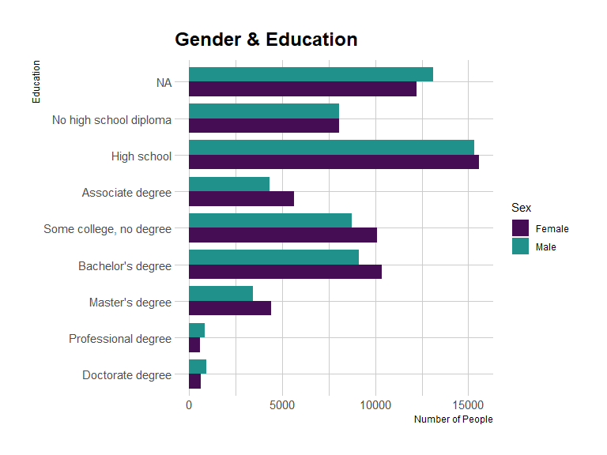<!-- -->

## Employment Status

``` r
# checking number of males and females with different employment statuses
df_cps_employment <- df_cps %>% 
  group_by(Sex, EmploymentStatus) %>%
  summarise(Total.Count = n()) 
```

    ## `summarise()` has grouped output by 'Sex'. You can override using the `.groups` argument.

``` r
df_cps_employment
```

    ## # A tibble: 12 x 3
    ## # Groups:   Sex [2]
    ##    Sex    EmploymentStatus   Total.Count
    ##    <chr>  <chr>                    <int>
    ##  1 Female Disabled                  3007
    ##  2 Female Employed                 29614
    ##  3 Female NA                       12269
    ##  4 Female Not in Labor Force        9910
    ##  5 Female Retired                  10715
    ##  6 Female Unemployed                1966
    ##  7 Male   Disabled                  2705
    ##  8 Male   Employed                 32119
    ##  9 Male   NA                       13520
    ## 10 Male   Not in Labor Force        5336
    ## 11 Male   Retired                   7904
    ## 12 Male   Unemployed                2237

``` r
# plotting gender and employment status
ggplot(df_cps_employment, 
       aes(fill = Sex, 
           y = EmploymentStatus, 
           x = Total.Count)) +
  geom_bar(stat = "identity") +
  scale_fill_manual(values = c('#450d54', '#21918c')) +
  theme_ipsum_es() +
  xlab('Number of People') + ylab('Employment Status') +
  ggtitle('Gender & Employment Status')
```

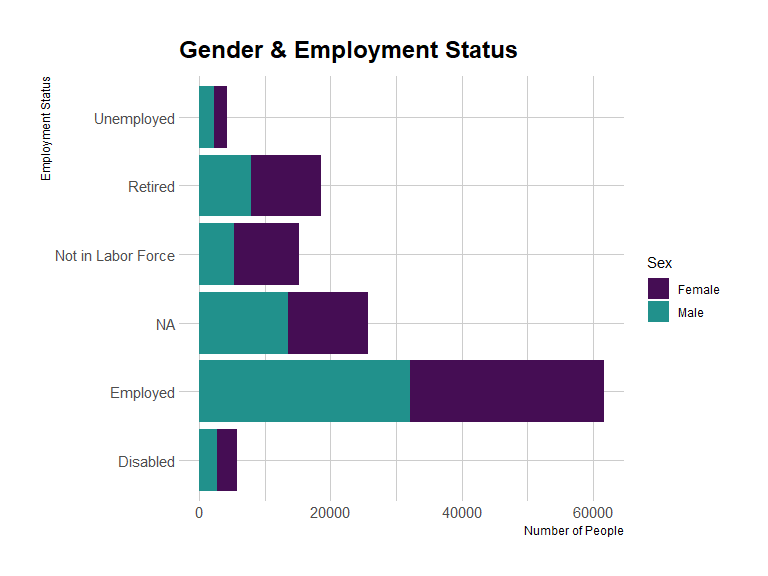<!-- -->

## Gender and Industry

``` r
# calculating male and female population in each industry
df_cps_industry <- df_cps %>% 
  group_by(Sex, Industry) %>%
  summarise(Total.Count = n()) 
```

    ## `summarise()` has grouped output by 'Sex'. You can override using the `.groups` argument.

``` r
head(df_cps_industry)
```

    ## # A tibble: 6 x 3
    ## # Groups:   Sex [1]
    ##   Sex    Industry                                    Total.Count
    ##   <chr>  <chr>                                             <int>
    ## 1 Female Agriculture, forestry, fishing, and hunting         337
    ## 2 Female Armed forces                                          7
    ## 3 Female Construction                                        402
    ## 4 Female Educational and health services                   11382
    ## 5 Female Financial                                          2368
    ## 6 Female Information                                         544

``` r
# plotting male and female population in different industries
ggplot(df_cps_industry, 
       aes(fill = Sex, y = Industry, x = Total.Count)) + 
  geom_bar(position = "fill", stat = "identity") +
  scale_fill_manual(values = c('#450d54', '#21918c')) +
  theme_ipsum_es() +
  xlab('Number of People') + ylab('Type of Industry') +
  ggtitle('Gender & Industry') 
```

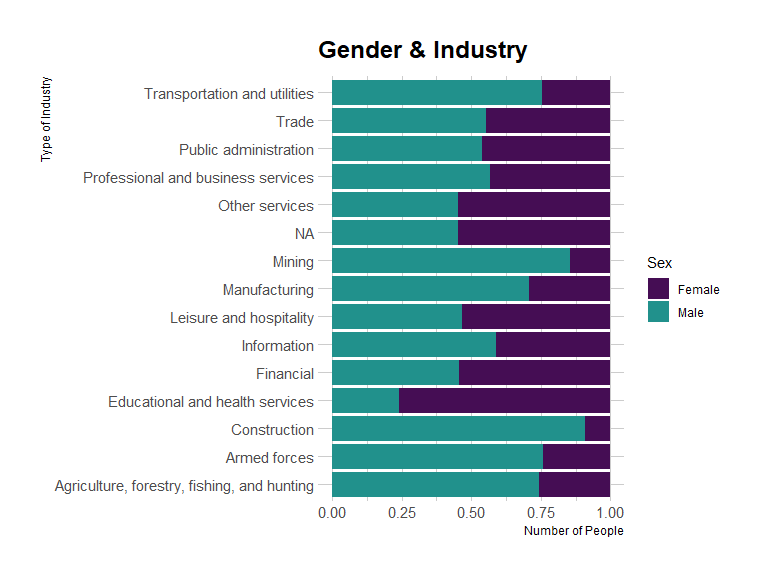<!-- -->

## Gender and Marital Status

``` r
# calculating percentage of males / females with different marital status
df_cps_marriage_f <- df_cps %>% 
  filter(Sex == 'Female') %>% 
  group_by(Married) %>% 
  summarise(Total.Count = n()) %>% 
  mutate(Percentage = paste0(round(((Total.Count / sum(Total.Count)) * 100), 2), "%"))

df_cps_marriage_m <- df_cps %>% 
  filter(Sex == 'Male') %>% 
  group_by(Married) %>% 
  summarise(Total.Count = n()) %>% 
  mutate(Percentage = paste0(round(((Total.Count / sum(Total.Count)) * 100), 2), "%"))
```

``` r
head(df_cps_marriage_f)
```

    ## # A tibble: 6 x 3
    ##   Married       Total.Count Percentage
    ##   <chr>               <int> <chr>     
    ## 1 Divorced             6378 9.45%     
    ## 2 Married             27827 41.24%    
    ## 3 NA                  12217 18.1%     
    ## 4 Never Married       14752 21.86%    
    ## 5 Separated            1173 1.74%     
    ## 6 Widowed              5134 7.61%

``` r
head(df_cps_marriage_m)
```

    ## # A tibble: 6 x 3
    ##   Married       Total.Count Percentage
    ##   <chr>               <int> <chr>     
    ## 1 Divorced             4773 7.48%     
    ## 2 Married             27682 43.37%    
    ## 3 NA                  13121 20.56%    
    ## 4 Never Married       16020 25.1%     
    ## 5 Separated             854 1.34%     
    ## 6 Widowed              1371 2.15%

``` r
pie(df_cps_marriage_f$Total.Count,
    main = 'Females Married Status',
    labels = df_cps_marriage_f$Percentage, border="white", 
    col = c('#fde725', '#5ec962', '#21918c', '#3b528b', '#440154', '#fc8961'))
legend('topright', df_cps_marriage_f$Married, cex = 0.8, fill = c('#fde725', '#5ec962', '#21918c', '#3b528b', '#440154', '#fc8961'))
```

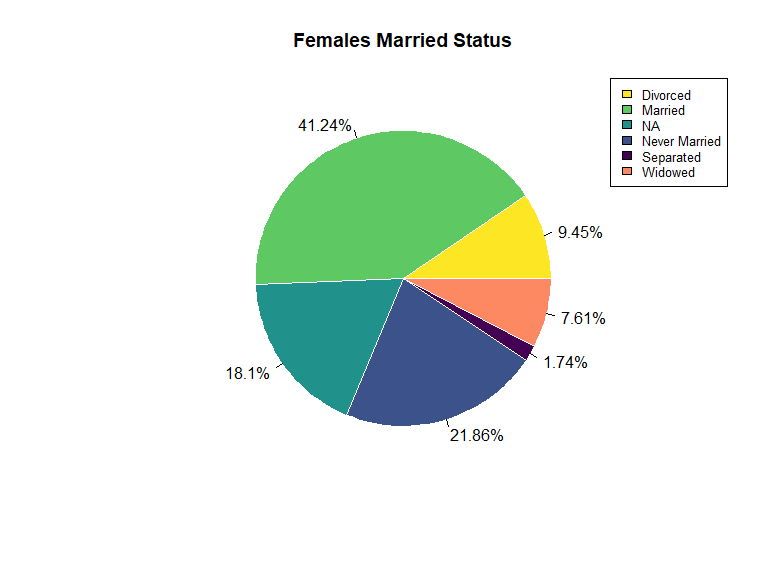<!-- -->

``` r
pie(df_cps_marriage_m$Total.Count,
    main = 'Males Married Status',
    labels = df_cps_marriage_m$Percentage, border="white", 
    col = c('#fde725', '#5ec962', '#21918c', '#3b528b', '#440154', '#fc8961'))
legend('topright', df_cps_marriage_m$Married, cex = 0.8, fill = c('#fde725', '#5ec962', '#21918c', '#3b528b', '#440154', '#fc8961'))
```

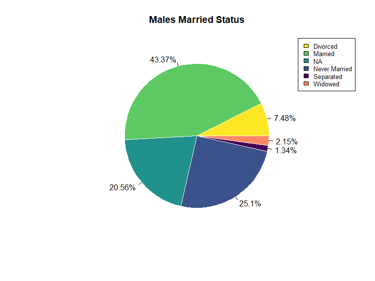<!-- -->

# Race Analysis

``` r
# checking for unique values of Race
unique(df_cps$Race)
```

    ## [1] "White"            "Black"            "Pacific Islander" "Multiracial"     
    ## [5] "American Indian"  "Asian"

## Race and Age

``` r
# plotting age data for different races
df_cps %>%
 ggplot( aes(x=Race, y=Age, fill=Race)) + 
    geom_boxplot() +
    xlab("class") +
    theme(legend.position="none") +
    xlab('Race') + ylab('Age') +
  scale_fill_manual(values = c('#fde725', '#5ec962', '#21918c', '#3b528b', '#440154', '#fc8961')) + theme_classic()
```

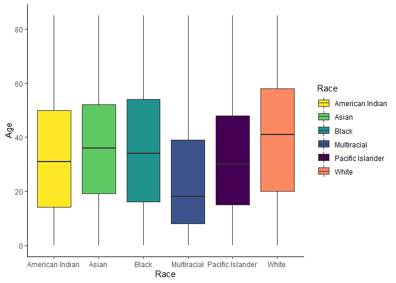<!-- -->

## Population Division

``` r
df_cps_race <- df_cps %>% 
  group_by(Race) %>% 
  summarise(Total.Count = n()) %>% 
  mutate(Percentage = paste0(round(((Total.Count / sum(Total.Count)) * 100), 2), "%")) %>%
  filter(!Race %in% c('American Indian', 'Pacific Islander'))

df_cps_race  %>% 
  arrange(desc(Total.Count))
```

    ## # A tibble: 4 x 3
    ##   Race        Total.Count Percentage
    ##   <chr>             <int> <chr>     
    ## 1 White            105921 80.67%    
    ## 2 Black             13913 10.6%     
    ## 3 Asian              6520 4.97%     
    ## 4 Multiracial        2897 2.21%

``` r
# plotting population divsion
pie(df_cps_race$Total.Count,
    main = 'Population Division',
    labels = df_cps_race$Percentage, border="white", 
    col = c('#fde725', '#5ec962', '#21918c', '#3b528b', '#440154', '#fc8961'))
legend('topright', df_cps_race$Race, cex = 0.8, fill = c('#fde725', '#5ec962', '#21918c', '#3b528b', '#440154', '#fc8961'))
```

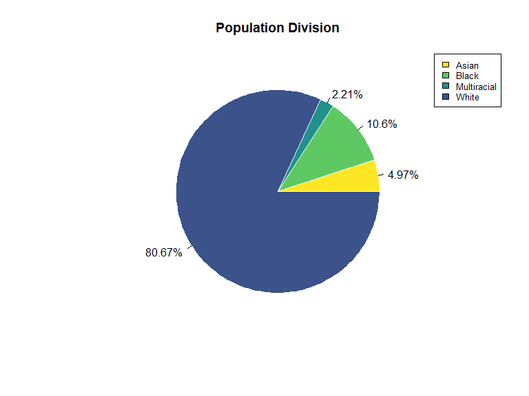<!-- -->

## Citizenship and Race

``` r
df_cps %>% group_by(Race, Citizenship) %>% summarise(Total.Count = n())
```

    ## `summarise()` has grouped output by 'Race'. You can override using the `.groups` argument.

    ## # A tibble: 18 x 3
    ## # Groups:   Race [6]
    ##    Race             Citizenship          Total.Count
    ##    <chr>            <chr>                      <int>
    ##  1 American Indian  Citizen, Native             1318
    ##  2 American Indian  Citizen, Naturalized          49
    ##  3 American Indian  Non-Citizen                   66
    ##  4 Asian            Citizen, Native             2780
    ##  5 Asian            Citizen, Naturalized        2118
    ##  6 Asian            Non-Citizen                 1622
    ##  7 Black            Citizen, Native            12480
    ##  8 Black            Citizen, Naturalized         764
    ##  9 Black            Non-Citizen                  669
    ## 10 Multiracial      Citizen, Native             2765
    ## 11 Multiracial      Citizen, Naturalized          53
    ## 12 Multiracial      Non-Citizen                   79
    ## 13 Pacific Islander Citizen, Native              485
    ## 14 Pacific Islander Citizen, Naturalized          81
    ## 15 Pacific Islander Non-Citizen                   52
    ## 16 White            Citizen, Native            96811
    ## 17 White            Citizen, Naturalized        4008
    ## 18 White            Non-Citizen                 5102

``` r
p1 <- ggplot(df_cps %>% 
         group_by(Race, Citizenship) %>% 
         summarise(Total.Count = n()),
       aes(fill = Citizenship,
           y = Total.Count,
           x = Race)) +
  geom_bar(position = 'stack',
           stat = 'identity') +
  scale_fill_manual(values = rev(c('#fc8961', '#b73779', '#51127c'))) +
  xlab('Race') +
  ylab('Total Count') +
  theme(axis.text.x = element_text(angle = 45, hjust = 1)) + 
  theme_light()
```

    ## `summarise()` has grouped output by 'Race'. You can override using the `.groups` argument.

``` r
p2 <- ggplot(df_cps %>% 
         group_by(Race, Citizenship) %>% 
         summarise(Total.Count = n()) %>% 
         filter(!Race %in% c('White')),
       aes(fill = Citizenship,
           y = Total.Count,
           x = Race)) +
  geom_bar(position = 'stack',
           stat = 'identity') +
  scale_fill_manual(values = rev(c('#fc8961', '#b73779', '#51127c'))) +
  xlab('Race') +
  ylab('Total Count') +
  theme(axis.text.x = element_text(angle = 45, hjust = 1)) + 
  theme_light()
```

    ## `summarise()` has grouped output by 'Race'. You can override using the `.groups` argument.

``` r
grid.arrange(p1, p2, nrow = 2)
```

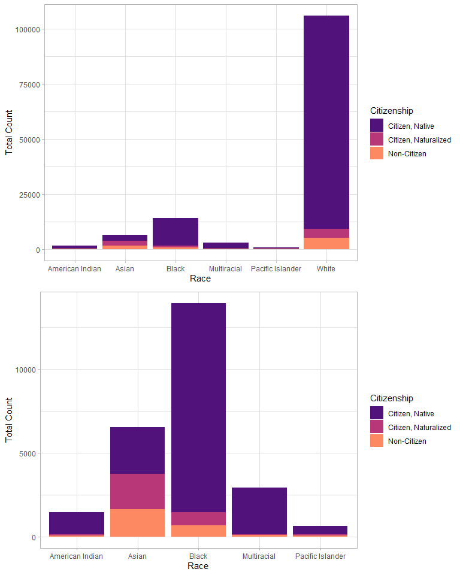<!-- -->

## Education and Race

``` r
# population of each race
df_cps_race_pop <- df_cps %>% group_by(Race) %>% summarise(Total.Count.Race = n())

df_cps_race_ed <- df_cps %>%
  group_by(Race, Education) %>%
  summarise(Total.Count.Race.Education = n()) %>%
  filter(!Race %in% c('American Indian', 'Pacific Islander', 'White')) %>%
  filter(!Education %in% c('Doctorate degree', 'Professional degree'))
```

    ## `summarise()` has grouped output by 'Race'. You can override using the `.groups` argument.

``` r
df_cps_race_ed <- merge(df_cps_race_ed, df_cps_race_pop, by = 'Race')

df_cps_race_ed <- df_cps_race_ed %>% mutate(Percentage = (Total.Count.Race.Education / Total.Count.Race)*100)

df_cps_race_ed
```

    ##           Race               Education Total.Count.Race.Education
    ## 1        Asian        Associate degree                        357
    ## 2        Asian       Bachelor's degree                       1468
    ## 3        Asian             High school                       1081
    ## 4        Asian         Master's degree                        624
    ## 5        Asian                      NA                       1231
    ## 6        Asian  No high school diploma                        739
    ## 7        Asian Some college, no degree                        723
    ## 8        Black        Associate degree                        900
    ## 9        Black       Bachelor's degree                       1321
    ## 10       Black             High school                       3621
    ## 11       Black         Master's degree                        575
    ## 12       Black                      NA                       3068
    ## 13       Black  No high school diploma                       2098
    ## 14       Black Some college, no degree                       2188
    ## 15 Multiracial        Associate degree                        150
    ## 16 Multiracial       Bachelor's degree                        237
    ## 17 Multiracial             High school                        456
    ## 18 Multiracial         Master's degree                         93
    ## 19 Multiracial                      NA                       1209
    ## 20 Multiracial  No high school diploma                        350
    ## 21 Multiracial Some college, no degree                        369
    ##    Total.Count.Race Percentage
    ## 1              6520   5.475460
    ## 2              6520  22.515337
    ## 3              6520  16.579755
    ## 4              6520   9.570552
    ## 5              6520  18.880368
    ## 6              6520  11.334356
    ## 7              6520  11.088957
    ## 8             13913   6.468770
    ## 9             13913   9.494717
    ## 10            13913  26.026019
    ## 11            13913   4.132825
    ## 12            13913  22.051319
    ## 13            13913  15.079422
    ## 14            13913  15.726299
    ## 15             2897   5.177770
    ## 16             2897   8.180877
    ## 17             2897  15.740421
    ## 18             2897   3.210217
    ## 19             2897  41.732827
    ## 20             2897  12.081464
    ## 21             2897  12.737314

``` r
ggplot(df_cps_race_ed,
       aes(axis1 = Race, axis2 = Education, y = Percentage)) +
  geom_alluvium(aes(fill = Race)) +
  geom_stratum(width = 1/2.7) +
  geom_text(stat = 'stratum', 
            aes(label = after_stat(stratum)), 
            size = 3) +
  scale_x_discrete(limits = c("Race", "Education"), 
                   expand = c(0.15, 0.05)) +
  theme_ipsum() +
  scale_fill_manual(values = c('#fde725', '#21918c', '#440154'))
```

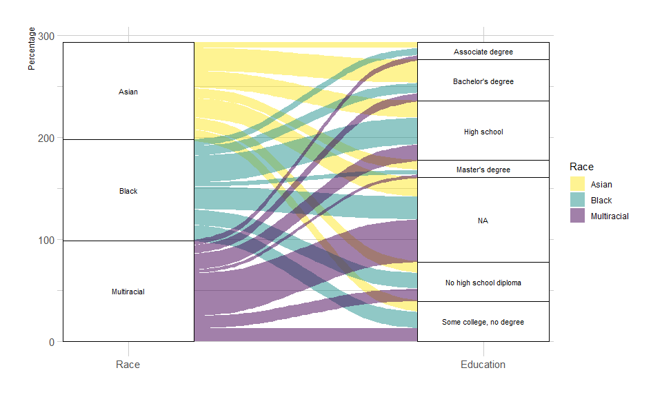<!-- -->
\#\# Employment Status and Race

``` r
df_cps_race_emp <- df_cps %>% 
  group_by(Race, EmploymentStatus) %>% 
  summarise(Total.Count.EmpStat = n())
```

    ## `summarise()` has grouped output by 'Race'. You can override using the `.groups` argument.

``` r
df_cps_race_emp <- merge(df_cps_race_emp, df_cps_race_pop, by = 'Race')

df_cps_race_emp <- df_cps_race_emp %>% mutate(Percentage = (Total.Count.EmpStat / Total.Count.Race)*100)

df_cps_race_emp
```

    ##                Race   EmploymentStatus Total.Count.EmpStat Total.Count.Race
    ## 1   American Indian           Disabled                  85             1433
    ## 2   American Indian           Employed                 535             1433
    ## 3   American Indian                 NA                 371             1433
    ## 4   American Indian Not in Labor Force                 231             1433
    ## 5   American Indian            Retired                 128             1433
    ## 6   American Indian         Unemployed                  83             1433
    ## 7             Asian           Disabled                 123             6520
    ## 8             Asian           Employed                3206             6520
    ## 9             Asian                 NA                1253             6520
    ## 10            Asian Not in Labor Force                1091             6520
    ## 11            Asian            Retired                 682             6520
    ## 12            Asian         Unemployed                 165             6520
    ## 13            Black           Disabled                1079            13913
    ## 14            Black           Employed                5552            13913
    ## 15            Black                 NA                3118            13913
    ## 16            Black Not in Labor Force                1834            13913
    ## 17            Black            Retired                1524            13913
    ## 18            Black         Unemployed                 806            13913
    ## 19      Multiracial           Disabled                 103             2897
    ## 20      Multiracial           Employed                 920             2897
    ## 21      Multiracial                 NA                1223             2897
    ## 22      Multiracial Not in Labor Force                 393             2897
    ## 23      Multiracial            Retired                 161             2897
    ## 24      Multiracial         Unemployed                  97             2897
    ## 25 Pacific Islander           Disabled                  27              618
    ## 26 Pacific Islander           Employed                 270              618
    ## 27 Pacific Islander                 NA                 156              618
    ## 28 Pacific Islander Not in Labor Force                 100              618
    ## 29 Pacific Islander            Retired                  39              618
    ## 30 Pacific Islander         Unemployed                  26              618
    ## 31            White           Disabled                4295           105921
    ## 32            White           Employed               51250           105921
    ## 33            White                 NA               19668           105921
    ## 34            White Not in Labor Force               11597           105921
    ## 35            White            Retired               16085           105921
    ## 36            White         Unemployed                3026           105921
    ##    Percentage
    ## 1    5.931612
    ## 2   37.334264
    ## 3   25.889742
    ## 4   16.120028
    ## 5    8.932310
    ## 6    5.792045
    ## 7    1.886503
    ## 8   49.171779
    ## 9   19.217791
    ## 10  16.733129
    ## 11  10.460123
    ## 12   2.530675
    ## 13   7.755337
    ## 14  39.905125
    ## 15  22.410695
    ## 16  13.181916
    ## 17  10.953784
    ## 18   5.793143
    ## 19   3.555402
    ## 20  31.756990
    ## 21  42.216086
    ## 22  13.565758
    ## 23   5.557473
    ## 24   3.348291
    ## 25   4.368932
    ## 26  43.689320
    ## 27  25.242718
    ## 28  16.181230
    ## 29   6.310680
    ## 30   4.207120
    ## 31   4.054909
    ## 32  48.385117
    ## 33  18.568556
    ## 34  10.948726
    ## 35  15.185846
    ## 36   2.856846

``` r
ggplot(df_cps_race_emp, 
       aes(fill = Race, 
           y = Percentage, 
           x = EmploymentStatus)) +
  geom_bar(stat = "identity") +
  scale_fill_manual(values = c('#fc8961', '#fde725', '#5ec962', '#21918c', '#3b528b', '#440154')) +
  theme_ipsum_es() +
  xlab('Employment Status') + ylab('Percentage (Count / Total Count of Particular Race)') +
  ggtitle('Race & Employment Status') + 
  theme(axis.text.x = element_text(angle = 45, hjust = 1, size = 8))
```

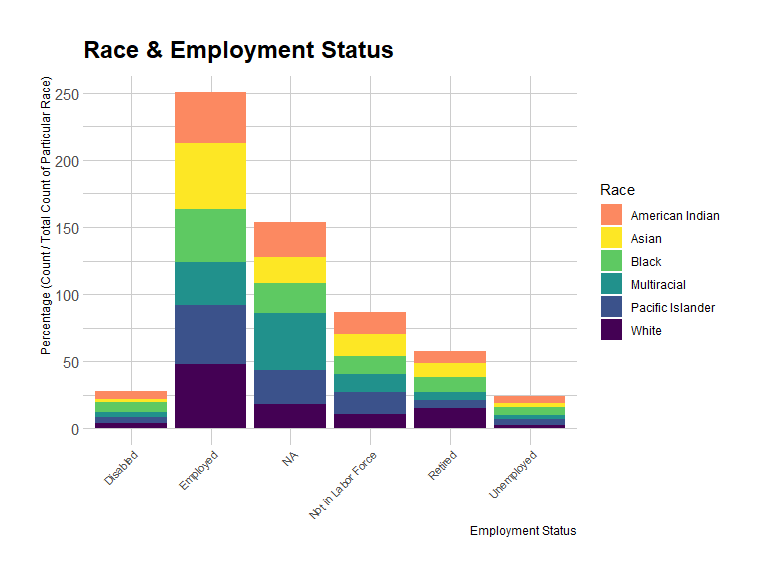<!-- -->

# Analysing Industry and Education columns

``` r
unique(df_cps$Industry)
```

    ##  [1] "NA"                                         
    ##  [2] "Professional and business services"         
    ##  [3] "Educational and health services"            
    ##  [4] "Transportation and utilities"               
    ##  [5] "Public administration"                      
    ##  [6] "Leisure and hospitality"                    
    ##  [7] "Trade"                                      
    ##  [8] "Manufacturing"                              
    ##  [9] "Other services"                             
    ## [10] "Financial"                                  
    ## [11] "Information"                                
    ## [12] "Construction"                               
    ## [13] "Mining"                                     
    ## [14] "Agriculture, forestry, fishing, and hunting"
    ## [15] "Armed forces"

``` r
df_cps_ed_ind <- df_cps %>% group_by(Education, Industry) %>% summarise(Total.Count = n())
```

    ## `summarise()` has grouped output by 'Education'. You can override using the `.groups` argument.

``` r
education_level <- rev(c('NA', 'No high school diploma',
                                     'High school', 'Associate degree',
                                     'Some college, no degree', 
                                     'Bachelor\'s degree', 'Master\'s degree',
                                     'Professional degree', 'Doctorate degree'))

df_cps_ed_ind
```

    ## # A tibble: 120 x 3
    ## # Groups:   Education [9]
    ##    Education        Industry                                    Total.Count
    ##    <chr>            <chr>                                             <int>
    ##  1 Associate degree Agriculture, forestry, fishing, and hunting         140
    ##  2 Associate degree Armed forces                                          3
    ##  3 Associate degree Construction                                        437
    ##  4 Associate degree Educational and health services                    1985
    ##  5 Associate degree Financial                                           444
    ##  6 Associate degree Information                                         143
    ##  7 Associate degree Leisure and hospitality                             468
    ##  8 Associate degree Manufacturing                                       696
    ##  9 Associate degree Mining                                               44
    ## 10 Associate degree NA                                                 2705
    ## # ... with 110 more rows

``` r
df_cps_ed_ind
```

    ## # A tibble: 120 x 3
    ## # Groups:   Education [9]
    ##    Education        Industry                                    Total.Count
    ##    <chr>            <chr>                                             <int>
    ##  1 Associate degree Agriculture, forestry, fishing, and hunting         140
    ##  2 Associate degree Armed forces                                          3
    ##  3 Associate degree Construction                                        437
    ##  4 Associate degree Educational and health services                    1985
    ##  5 Associate degree Financial                                           444
    ##  6 Associate degree Information                                         143
    ##  7 Associate degree Leisure and hospitality                             468
    ##  8 Associate degree Manufacturing                                       696
    ##  9 Associate degree Mining                                               44
    ## 10 Associate degree NA                                                 2705
    ## # ... with 110 more rows

``` r
ggplot(df_cps_ed_ind, 
       aes(fill = factor(Education, levels = education_level), y = Total.Count, x = Industry)) + 
  geom_bar(position = 'fill', stat = 'identity') +
#  scale_fill_manual(values = c('#fde725', '#addc30', '#5ec962', '#28ae80', '#21918c', '#2c728e', '#3b528b', '#472d7b', '#440154')) +
  scale_fill_brewer(palette = 'Accent') +
  theme_ipsum() +
  ylab('Total Count') +
  ggtitle('Industry and Education') +
  theme(axis.text.x = element_text(angle = 45, hjust = 1, size = 8)) +
  guides(fill=guide_legend(title="Education Level"))
```

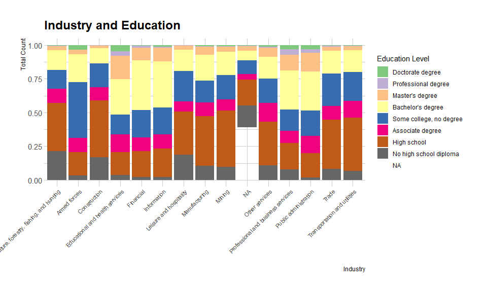<!-- -->
